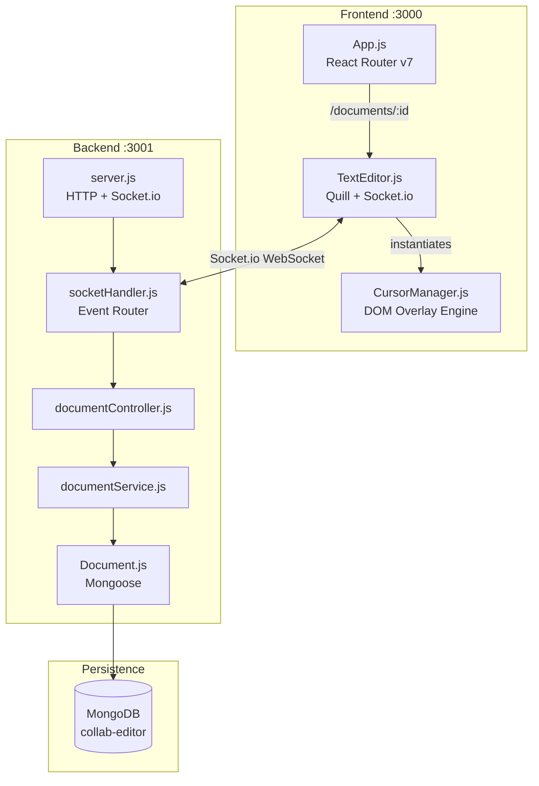
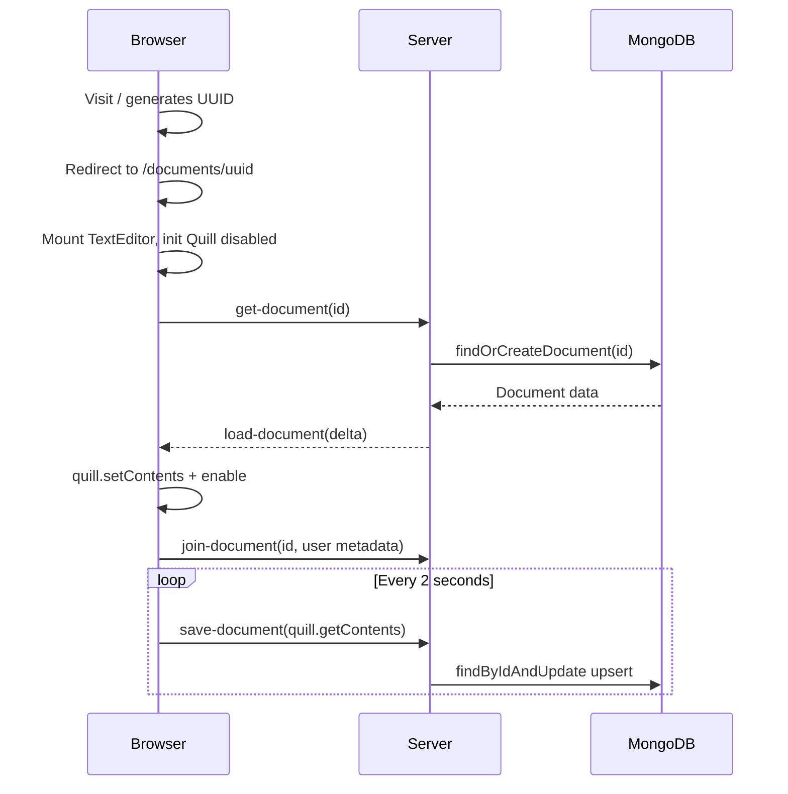
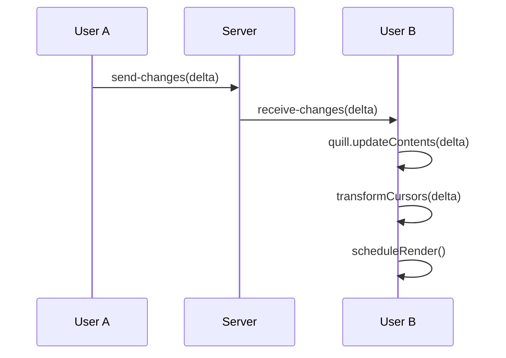
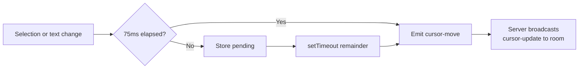
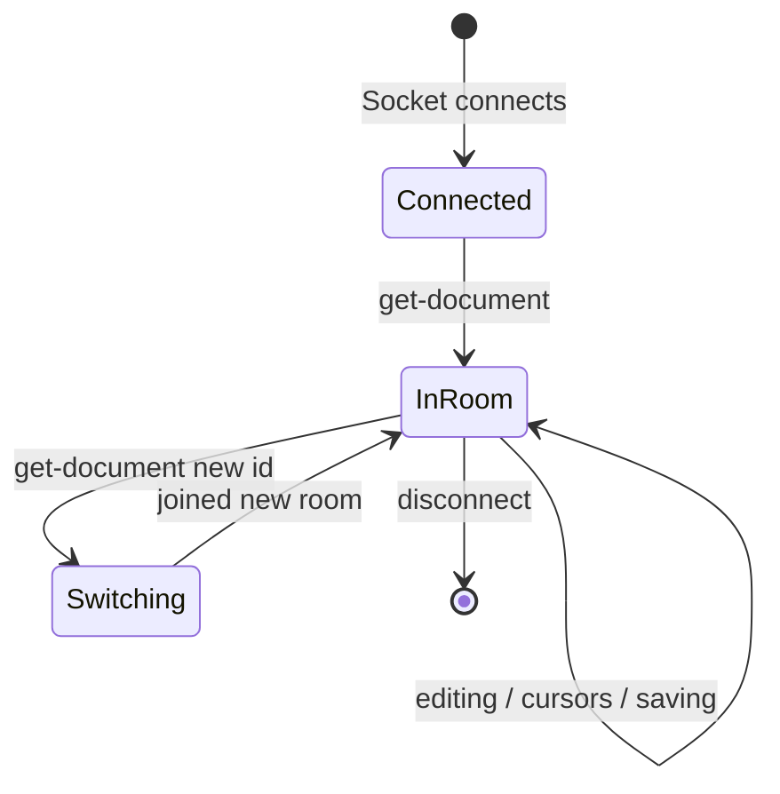
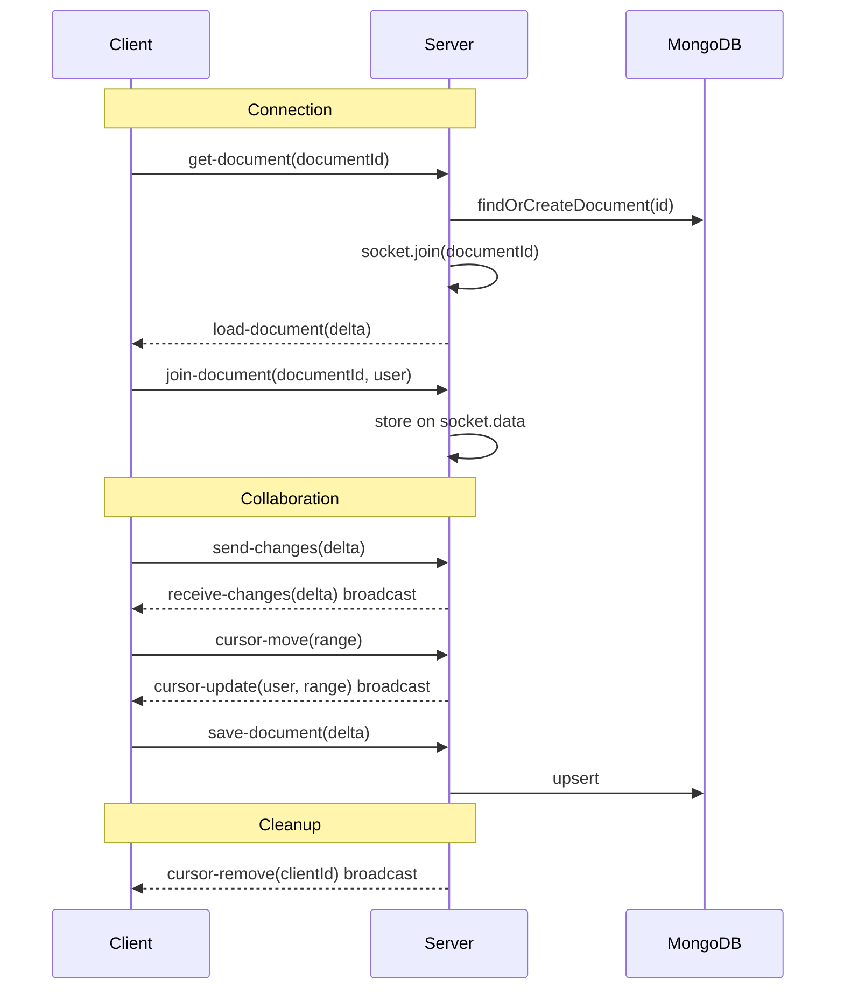

# Collab Editor

A real-time collaborative text editor where multiple users edit the same document simultaneously — with live cursor tracking, automatic persistence, and instant synchronization. Think Google Docs, built from scratch with React, Quill, Socket.io, and MongoDB.

> **8 source files. ~600 lines of custom code. 12 production features.**

## What Makes This Technically Interesting

This isn't a chat-with-shared-textarea demo. The engineering challenges here are the same ones Google Docs, Figma, and Notion solve at scale:

- **Delta-based operational transformation** — Edits travel as Quill Deltas (insert/delete/retain ops), not full document snapshots. This keeps payloads small and merges conflict-free.
- **Cursor drift correction** — When User A types at position 10, every remote cursor at position >= 10 must shift forward in real time. `delta.transformPosition()` handles this math on every keystroke.
- **DOM overlay cursor engine** — Remote cursors are rendered as an absolutely positioned overlay *outside* React's render cycle. A plain ES6 class (`CursorManager`) manipulates the DOM directly with `requestAnimationFrame` batching for performance — no re-renders, no virtual DOM overhead.
- **WebSocket-only architecture** — Zero REST endpoints. Every client-server interaction (document load, save, edit sync, cursor broadcast) flows through Socket.io events over a single persistent connection.
- **75ms throttled cursor emission** — A manual throttle (not lodash) with `setTimeout` and pending-range tracking prevents flooding the server while keeping cursors visually smooth.

| Metric | Value |
|--------|-------|
| Cursor broadcast throttle | 75ms |
| Autosave interval | 2s |
| Render batching | requestAnimationFrame |
| Cursor color palette | 8 deterministic colors |
| Identity persistence | localStorage across sessions |

---

## System Architecture



**Frontend** — React 19 functional component with 7 `useEffect` hooks managing socket lifecycle, Quill initialization, document loading, autosave, event listeners, and cursor throttle cleanup. `CursorManager` is intentionally *not* a React component — it's a plain class that owns a DOM overlay for zero-overhead cursor rendering.

**Backend** — Layered Node.js architecture. No Express, no REST. A raw HTTP server hosts Socket.io, which routes all events through a handler → controller → service → model pipeline. Each document ID maps to a Socket.io room for scoped broadcasting.

**Database** — MongoDB via Mongoose. Documents are stored as `{ _id: String, data: Mixed }` where `_id` is the UUID from the URL and `data` is the full Quill Delta JSON. Autosaved every 2 seconds via upsert.

| Layer | File | Responsibility |
|-------|------|---------------|
| Handler | `socketHandler.js` | Event routing, room join/leave, cursor broadcast |
| Controller | `documentController.js` | Thin facade mapping actions to services |
| Service | `documentService.js` | `findOrCreateDocument()`, `saveDocument()` with upsert |
| Model | `Document.js` | Mongoose schema, no version key |
| Config | `db.js` | Singleton connection promise |

---

## Core Workflows

### Document Lifecycle



- Visiting `/` generates a UUID v4 and redirects to `/documents/:uuid`
- Each unique URL is a unique document — share the link to collaborate
- Server finds or creates the document in MongoDB, joins the socket to that room
- Autosave runs client-side on a 2s interval via `setInterval`

### Real-Time Collaborative Editing



When a user types, Quill generates a Delta (e.g., `retain 5, insert "hello"`). The client emits `send-changes` and the server broadcasts `receive-changes` to all other sockets in the room. The receiving client applies the delta and immediately transforms all remote cursor positions to account for shifted text.

### Cursor System

The cursor system has three parts: identity, emission, and rendering.

**Identity** — On first visit, the user gets a persistent UUID (`localStorage`) and is prompted for a display name. A deterministic hash maps their ID to one of 8 colors. This persists across sessions.

**Emission** — Cursor positions are emitted on every selection change and text change, throttled to 75ms. The throttle is manual: if under 75ms since last emit, the range is stored as `pendingRange` and a `setTimeout` fires for the remainder. On blur or disconnect, a forced `null` range triggers `cursor-remove`.



**Rendering** — `CursorManager` maintains a `Map` of remote cursors. On `cursor-update`, it calls `upsertCursor()` which stores the range and schedules a render. Rendering uses `requestAnimationFrame` to batch DOM updates:

1. For each cursor, call `quill.getBounds(index, length)` to get pixel coordinates
2. Position a `.remote-cursor` marker via CSS `transform: translate()`
3. The marker contains a colored caret (`.remote-cursor__caret`) and a name label (`.remote-cursor__label`)

**Drift correction** — When any text change arrives (local or remote), `transformCursors(delta)` runs `delta.transformPosition()` on every stored cursor range, shifting positions to stay correct. Ranges are clamped to document bounds to prevent out-of-bounds rendering.

**Cleanup** — Cursors are removed on editor blur, document switch, or socket disconnect. `CursorManager.destroy()` tears down all event listeners and cancels pending animation frames. Scroll and resize events trigger `scheduleRender()` to reposition cursors.

### Room Management



The server tracks per-socket state in `socket.data`:
```js
socket.data = {
    documentId: "current-doc-uuid",
    user: { clientId, displayName, color }
}
```

When switching documents, the server emits `cursor-remove` to the old room, leaves it, and joins the new one. On disconnect, `cursor-remove` broadcasts to the current room.

---

## Socket.io Protocol Reference

Every client-server interaction uses these events. No REST endpoints exist.



| Event | Direction | Payload | Purpose |
|-------|-----------|---------|---------|
| `get-document` | Client to Server | `documentId` | Request document, join room |
| `load-document` | Server to Client | Quill Delta | Deliver document contents |
| `join-document` | Client to Server | `{ documentId, user }` | Register collaborator metadata |
| `send-changes` | Client to Server | Quill Delta | Broadcast edit to room |
| `receive-changes` | Server to Client | Quill Delta | Apply remote edit |
| `cursor-move` | Client to Server | `{ range }` | Broadcast cursor position |
| `cursor-update` | Server to Client | `{ user, range }` | Render remote cursor |
| `cursor-remove` | Server to Client | `{ clientId }` | Remove cursor marker |
| `save-document` | Client to Server | Quill Delta | Persist to MongoDB |

---

## Getting Started

### Prerequisites

- Node.js (v18+)
- MongoDB running locally on default port (27017)

### Run the project

```bash
# Terminal 1: Start the backend
cd backend
npm install
npm run dev        # nodemon on port 3001

# Terminal 2: Start the frontend
cd frontend
npm install
npm start          # React dev server on port 3000
```

Open `http://localhost:3000` — you'll be redirected to a new document. Open the same URL in a second browser tab to see real-time collaboration.

### Where to start reading code

| If you want to understand... | Start here |
|------------------------------|-----------|
| How the editor works | `frontend/src/TextEditor.js` — single component, all hooks |
| How cursors render | `frontend/src/CursorManager.js` — standalone ES6 class |
| How events are handled server-side | `backend/websocket/socketHandler.js` — all Socket.io events |
| How documents are persisted | `backend/services/documentService.js` — MongoDB operations |
| How routing works | `frontend/src/App.js` — 4 lines of React Router |

### Environment variables

| Variable | Default | Purpose |
|----------|---------|---------|
| `SOCKET_PORT` | `3001` | Backend server port |
| `CLIENT_ORIGIN` | `http://localhost:3000` | CORS origin for Socket.io |
| `MONGODB_URI` | `mongodb://localhost/collab-editor` | MongoDB connection string |

---

## Project Structure

```
collab-editor/
├── .claude/
│   └── skills/
│       ├── skill-creator/SKILL.md
│       └── doc-coauthoring/SKILL.md
├── docs/
│   ├── ARCHITECTURE.md              <-- you are here
│   └── CLAUDE_SKILLS.md
├── backend/
│   ├── server.js                    # HTTP + Socket.io entry
│   ├── config/db.js                 # Mongoose connection
│   ├── controllers/documentController.js
│   ├── models/Document.js           # { _id: String, data: Mixed }
│   ├── services/documentService.js  # find-or-create, upsert
│   └── websocket/socketHandler.js   # All event handlers
├── frontend/src/
│   ├── index.js                     # React 19 entry
│   ├── App.js                       # Router: / -> /documents/:uuid
│   ├── TextEditor.js                # Editor component + all hooks
│   ├── CursorManager.js             # Remote cursor DOM overlay
│   └── styles.css                   # Layout + cursors + print
├── package.json
└── README.md
```

---

## Feature Matrix

| Feature | Key Files |
|---------|-----------|
| Real-time collaborative editing | `TextEditor.js`, `socketHandler.js` |
| Document persistence with autosave | `documentService.js`, `Document.js` |
| UUID-based document routing | `App.js` |
| Browser-persisted collaborator identity | `TextEditor.js` (localStorage) |
| Live remote cursor tracking | `CursorManager.js`, `socketHandler.js` |
| Delta-aware cursor drift correction | `CursorManager.js` transformCursors |
| Throttled cursor emission at 75ms | `TextEditor.js` emitCursorMove |
| 8-color deterministic cursor palette | `TextEditor.js` getStableHash |
| Scroll/resize responsive cursors | `CursorManager.js` event listeners |
| Print-safe rendering | `styles.css` @media print |
| Room management with session cleanup | `socketHandler.js` emitCursorRemoval |
| Rich text toolbar | `TextEditor.js` TOOLBAR_OPTIONS |

---

## Tech Stack

| Layer | Technology | Version |
|-------|-----------|---------|
| UI Framework | React | 19.x |
| Rich Text Editor | Quill | 2.x |
| Real-time Transport | Socket.io | 4.x |
| Client Routing | react-router-dom | 7.x |
| ODM | Mongoose | 9.x |
| Database | MongoDB | - |
| Build | Create React App | 5.x |
| Dev Server | nodemon | 3.x |

---

## Changelog

| Date | Change |
|------|--------|
| 2026-03-18 | Architecture doc rewritten with doc-coauthoring workflow |
| 2026-03-17 | CursorManager, remote cursor tracking, throttled emission |
| 2026-03-15 | Backend refactor: layered architecture |
| 2026-03-15 | MongoDB integration, Quill editor, basic real-time editing |
