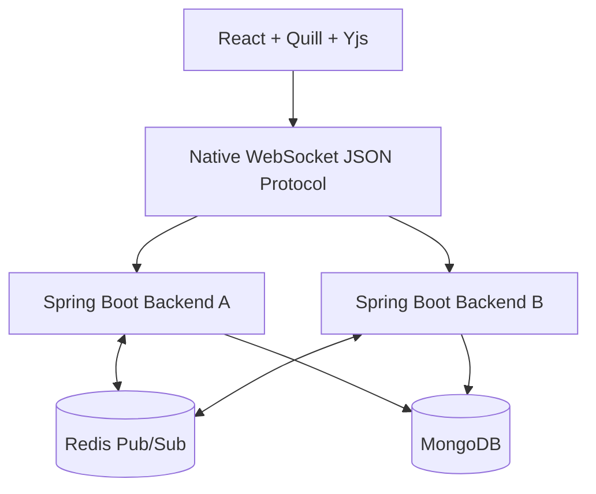

# Java Backend Architecture

This project is now designed around a Java Spring Boot backend.

## Current System



## Responsibilities By Layer

| Layer | Responsibility |
|---|---|
| React | UI, auth screens, dashboard, editor shell |
| Quill | Rich text editing UI |
| Yjs | CRDT content convergence in the browser |
| Yjs Awareness | Ephemeral collaborator presence and cursor state |
| Native WebSocket | Browser-to-backend realtime transport |
| Spring Boot | Auth, access control, room routing, persistence, Redis fanout |
| Redis | Cross-instance Pub/Sub for realtime events |
| MongoDB | Users, documents, snapshots, versions, access metadata |

## Why Java Backend

The backend uses Java because the interview story is Java-focused.

This gives a clean backend explanation:

* Spring Security validates JWTs.
* Spring WebSocket owns realtime sessions.
* Spring Data MongoDB owns persistence.
* Spring Data Redis owns Pub/Sub fanout.
* Gradle owns backend build and dependency management.

React remains JavaScript because it is the frontend framework.

## Content Collaboration Flow

1. A user types in Quill.
2. Yjs updates the local CRDT document.
3. The frontend serializes the Yjs update as Base64 inside a JSON WebSocket message.
4. Spring Boot verifies the WebSocket session is authenticated and authorized for the document.
5. Spring Boot broadcasts the update to other sessions in the same document room.
6. If Redis is enabled, Spring Boot also publishes the message to Redis Pub/Sub.
7. Other backend instances receive the Redis message and deliver it to their local clients.
8. Other browsers apply the Yjs update and converge.

## WebSocket Message Shape

```json
{
  "event": "yjs-update",
  "payload": {
    "documentId": "document-id",
    "update": {
      "__binaryBase64": "..."
    }
  }
}
```

Important events:

* `get-document`
* `load-document`
* `join-document`
* `yjs-update`
* `request-document-sync`
* `document-sync`
* `awareness-update`
* `request-awareness-sync`
* `awareness-sync`
* `awareness-remove`
* `awareness-leave`
* `save-document`
* `get-document-history`
* `document-history`
* `document-history-updated`
* `restore-version`
* `document-restored`

## Auth And Access Control

Auth flow:

1. User registers or logs in.
2. Spring Boot hashes passwords with BCrypt.
3. Spring Boot issues a JWT.
4. React stores the JWT in `localStorage`.
5. REST requests send `Authorization: Bearer <token>`.
6. WebSocket connections use `/ws?token=<jwt>`.
7. The Java backend resolves the authenticated user.

Document authorization:

* first authenticated opener claims a legacy unowned document
* owner can share access by email
* collaborators get editor access
* only owner can share
* unauthorized users cannot load, save, restore, or join the document room

## Persistence Model

MongoDB document shape:

```js
{
  _id: "document-id",
  title: "Untitled document",
  ownerId: "user-id",
  collaborators: [
    { userId: "user-id", email: "user@example.com", role: "editor" }
  ],
  yjsState: "<base64 snapshot>",
  data: { ops: [] },
  contentFormat: "yjs",
  versions: [
    {
      versionId: "version-id",
      source: "checkpoint",
      yjsState: "<base64 snapshot>",
      data: { ops: [] }
    }
  ]
}
```

The Java backend treats Yjs as an opaque payload. That is intentional.

Yjs solves CRDT convergence in the browser. Java solves:

* authentication
* authorization
* routing
* persistence
* Redis fanout
* version restore

## Redis Scaling

Single backend:

```text
Client A -> Spring Boot A -> Client B
```

Multiple backends:

```text
Client A -> Spring Boot A -> Redis Pub/Sub -> Spring Boot B -> Client B
```

Redis is enabled with:

```text
REDIS_ENABLED=true
REDIS_URL=redis://localhost:6379
```

## Operational Endpoints

* `/healthz`: process liveness
* `/readyz`: MongoDB readiness
* `/metrics`: Prometheus-style operational metrics

## Runtime Modes

| Mode | Purpose |
|---|---|
| Single backend | Normal local development |
| Redis scaled | Validate multi-instance fanout |
| Docker Compose | Package frontend, Spring Boot backend, MongoDB, and Redis together |

## Code Reading Order

1. `backend/src/main/java/com/collabeditor/CollabEditorApplication.java`
2. `backend/src/main/java/com/collabeditor/config/SecurityConfig.java`
3. `backend/src/main/java/com/collabeditor/auth/AuthService.java`
4. `backend/src/main/java/com/collabeditor/document/DocumentService.java`
5. `backend/src/main/java/com/collabeditor/realtime/CollaborationGateway.java`
6. `backend/src/main/java/com/collabeditor/realtime/CollaborationWebSocketHandler.java`
7. `frontend/src/realtimeClient.js`
8. `frontend/src/TextEditor.js`

## Interview Summary

> The frontend uses React, Quill, and Yjs. Yjs handles CRDT convergence in the browser. The backend is Java Spring Boot and owns JWT auth, document authorization, native WebSocket session routing, MongoDB persistence, Redis Pub/Sub fanout, version history, restore, and operational endpoints.
