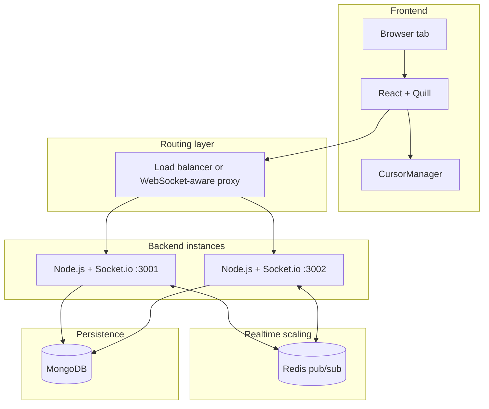

# Collab Editor Architecture

This document explains what the project does today, how the main parts fit together, and what is still planned.

The most important truth to remember is this:

- Today, the editor uses delta-based real-time sync with Socket.io.
- Today, the backend can run in single-node mode or Redis-scaled mode.
- Today, persistence is handled by MongoDB autosave.
- Today, the project is not yet a CRDT system.
- The planned upgrade that changes collaboration correctness in a big way is Yjs.

If you want the step-by-step change history, read [Design Flow](./Design%20Flow.md).
If you want beginner-friendly explanations of the concepts, start with [Learning Path](./LEARNING_PATH.md).

## Current System At A Glance

| Area | Current State |
|------|---------------|
| Editor | React + Quill |
| Realtime transport | Socket.io |
| Collaboration model | Delta broadcast with cursor drift correction |
| Horizontal scaling | Socket.io Redis adapter when `REDIS_URL` is set |
| Persistence | MongoDB via Mongoose |
| Identity | Browser-persisted `localStorage` identity |
| Cursor rendering | Custom DOM overlay via `CursorManager` |
| Next major upgrade | CRDT collaboration with Yjs |

## Honest Architecture Summary

This is the clean way to describe the project in an interview:

- The frontend is a React application that mounts a Quill editor and connects to the backend with Socket.io.
- The backend is a Node.js Socket.io server with a layered structure for config, services, controllers, and socket handling.
- Documents are stored in MongoDB and autosaved periodically.
- Real-time edits and cursor updates are sent through Socket.io rooms keyed by `documentId`.
- When Redis is enabled, Socket.io uses Redis pub/sub so events can move across multiple backend instances.
- The current sync model is strong for a portfolio project, but it is still delta-based synchronization, not full CRDT or full OT conflict resolution.

That last point matters. It makes your explanation more credible.

## Runtime Architecture



### What changes depending on environment

There are two valid runtime modes today:

| Mode | When used | Behavior |
|------|-----------|----------|
| Single-node mode | `REDIS_URL` is not set | One backend instance handles all socket events locally |
| Redis-scaled mode | `REDIS_URL` is set | Multiple backend instances exchange Socket.io events through Redis |

In production, a load balancer must support sticky sessions or use a WebSocket-aware proxy.

## Main Components

### Frontend

Main files:

- `frontend/src/App.js`
- `frontend/src/TextEditor.js`
- `frontend/src/CursorManager.js`
- `frontend/src/styles.css`

Responsibilities:

- Create or open a document URL
- Initialize Quill
- Connect to the Socket.io backend
- Send document edits as Quill deltas
- Send cursor positions
- Render remote cursors efficiently
- Persist user identity in `localStorage`

### Backend

Main files:

- `backend/server.js`
- `backend/config/db.js`
- `backend/config/redisAdapter.js`
- `backend/websocket/socketHandler.js`
- `backend/services/documentService.js`
- `backend/models/Document.js`

Responsibilities:

- Start the Socket.io server
- Connect to MongoDB
- Optionally enable the Redis adapter
- Join sockets to document rooms
- Broadcast text changes and cursor changes
- Save documents to MongoDB
- Cleanly shut down Redis clients when the process exits

### Database

Documents are stored in MongoDB roughly like this:

```js
{
  _id: "document-uuid",
  data: <Quill Delta JSON>
}
```

This is simple and works well for the current phase.
It is not yet versioned history.

## Collaboration Model Today

### Document load flow

1. The browser opens `/documents/:id`.
2. The frontend emits `get-document(documentId)`.
3. The backend finds or creates the document in MongoDB.
4. The socket joins the room named after that `documentId`.
5. The backend emits `load-document`.
6. The client loads the Quill contents and enables editing.

### Edit flow

1. The user types in Quill.
2. Quill produces a Delta.
3. The frontend emits `send-changes(delta)`.
4. The backend broadcasts `receive-changes(delta)` to the rest of the room.
5. Other clients apply the delta with `quill.updateContents(delta)`.

### Cursor flow

1. The user moves their caret or types.
2. The frontend emits a throttled `cursor-move`.
3. The backend uses room-scoped broadcasting to forward `cursor-update`.
4. Other clients store the remote cursor state in `CursorManager`.
5. `CursorManager` renders the markers with `requestAnimationFrame`.

### Autosave flow

1. Every 2 seconds, the client emits `save-document(quill.getContents())`.
2. The backend upserts the document in MongoDB.

## Why Cursor Drift Correction Exists

Cursor drift is one of the first real problems in collaborative editors.

Example:

- User B's cursor is at index 10
- User A inserts 5 characters at index 5
- User B's cursor should now move to index 15

The project handles that today by transforming stored cursor positions with Quill Delta `transformPosition(...)`.

This is a strong real-time feature, but it does not mean the whole editor is already a full CRDT system.

## What Redis Adds

Without Redis:

- backend instance A only knows about sockets connected to A
- backend instance B only knows about sockets connected to B
- users connected to different backend instances will not see each other's real-time events

With Redis:

- backend instance A publishes socket events through Redis
- backend instance B receives the same events through Redis
- document edits and cursor updates work across multiple Node.js processes

The Redis adapter is implemented in `backend/config/redisAdapter.js`.

### Operational details added in this phase

- env-gated enablement through `REDIS_URL`
- bounded reconnect delay using `Math.min(retries * 50, 2000)`
- explicit logs:
  - `[Redis] Running in single-node mode`
  - `[Redis] Connected to pub/sub`
  - `[Redis] Adapter enabled`
- graceful shutdown on `SIGINT` and `SIGTERM`

## Architecture Decisions Worth Explaining In Interviews

### Why Socket.io instead of plain WebSocket?

- Easier room-based broadcasting
- Helpful reconnect and event abstractions
- Better developer velocity for a project like this

### Why MongoDB for now?

- Easy document-shaped storage for Quill Delta JSON
- Fast to iterate on for a real-time editor prototype

### Why custom cursor rendering?

- Remote cursors need frequent updates
- A DOM overlay lets the app avoid unnecessary React re-renders
- `requestAnimationFrame` batching reduces layout thrashing

### Why Redis as the next scaling step?

- It solves cross-instance event propagation
- It is a realistic production concern for WebSocket systems
- It gives the project a stronger distributed-systems story

## What The Project Is Not Yet

It is important to explain the limits clearly.

The project is not yet:

- a CRDT-based editor
- a Yjs-powered shared document system
- a version-history system
- a Dockerized deployment
- a Kubernetes deployment

Those are planned future improvements, not current features.

## Code Reading Order

If you want to understand the code quickly, read in this order:

1. `frontend/src/TextEditor.js`
2. `frontend/src/CursorManager.js`
3. `backend/websocket/socketHandler.js`
4. `backend/config/redisAdapter.js`
5. `backend/server.js`
6. `backend/services/documentService.js`

## Learning Docs

These are the beginner-friendly companion docs for interview prep:

- [Learning Path](./LEARNING_PATH.md)
- [Realtime Collaboration 101](./REALTIME_COLLABORATION_101.md)
- [Redis Scaling 101](./REDIS_SCALING_101.md)
- [CRDT and Yjs 101](./CRDT_YJS_101.md)
- [Docker and Kubernetes 101](./DOCKER_KUBERNETES_101.md)
- [Design Flow](./Design%20Flow.md)

## Local Verification Setup

### Single-node mode

```bash
cd backend
npm run devStart

cd frontend
npm start
```

### Redis-scaled mode

```bash
# Redis on localhost:6379

cd backend
npm run devStart:redis

cd backend
npm run devStart:redis:3002

cd frontend
npm start

cd frontend
npm run start:socket3002
```

Open the same document in both frontend instances and verify:

- text sync
- cursor sync
- document persistence

## Interview One-Liner

If you need a fast summary:

> I built a real-time collaborative editor with React, Quill, Socket.io, MongoDB, and Redis. The current version supports delta-based editing, cursor tracking with drift correction, MongoDB autosave, and cross-instance Socket.io scaling through Redis. The next major step is upgrading collaboration correctness with Yjs and CRDTs.
