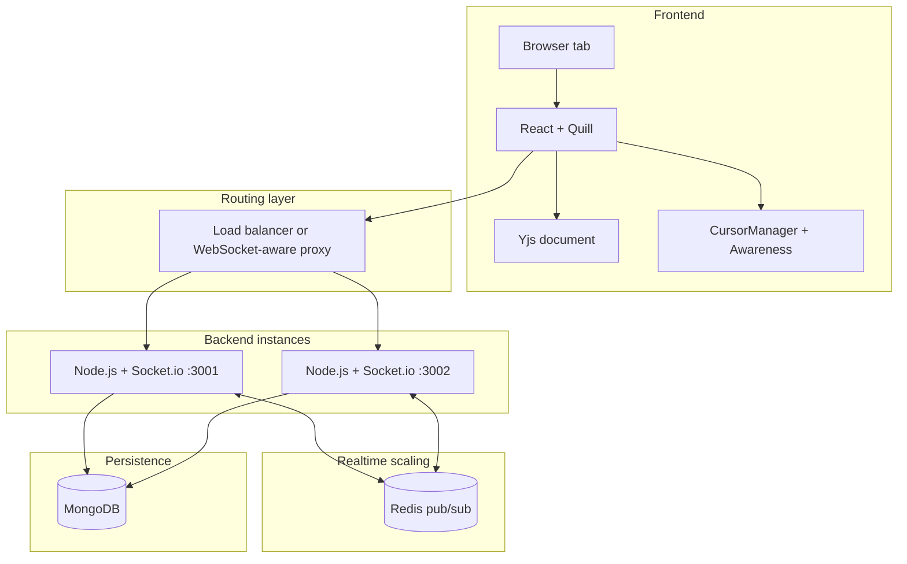

# Collab Editor Architecture

This document explains what the project does today, how the main parts fit together, and what is still planned.

The most important truth to remember is this:

- Today, document content uses Yjs-based CRDT sync.
- Today, cursor and presence updates use Yjs awareness over the existing Socket.io transport.
- Today, the backend can run in single-node mode or Redis-scaled mode.
- Today, the project also has a Docker Compose full-stack runtime with frontend, backend, MongoDB, and Redis.
- Today, MongoDB persistence stores a Yjs snapshot, a Quill delta mirror, and timed version checkpoints.
- The next major upgrades are authenticated access control and production-grade observability.

If you want the step-by-step change history, read [Design Flow](./Design%20Flow.md).
If you want beginner-friendly explanations of the concepts, start with [Learning Path](./LEARNING_PATH.md).
If you want the exact local startup steps, read [Local Dev Setup](./LOCAL_DEV_SETUP.md).
If you want interview-focused HLD and LLD preparation, read [System Design Interview Guide](./SYSTEM_DESIGN_INTERVIEW_GUIDE.md).

## Current System At A Glance

| Area | Current State |
|------|---------------|
| Editor | React + Quill |
| Realtime transport | Socket.io |
| Content model | Yjs CRDT |
| Presence model | Yjs awareness-based active roster and cursor sync |
| Horizontal scaling | Socket.io Redis adapter when `REDIS_URL` is set |
| Persistence | MongoDB with active Yjs snapshot + Quill delta mirror + timed checkpoints |
| Identity | Browser-persisted `localStorage` identity |
| Packaging | Docker Compose full stack with Nginx frontend, Node backend, MongoDB, and Redis |
| Next major upgrade | Authenticated access control |

## Current Vs Target Architecture

| Area | Current Architecture | Target Architecture |
|------|----------------------|---------------------|
| Editor UI | React + Quill | React + Quill or equivalent collaborative editor shell |
| Content sync | Yjs CRDT over Socket.io | Yjs CRDT with stronger production collaboration workflow |
| Presence and cursors | Yjs awareness-based roster and cursor state with drift correction in the renderer | Richer awareness UX with authenticated identity and access control |
| Realtime gateway | Node.js + Socket.io | Node.js + Socket.io behind a production WebSocket-aware proxy |
| Horizontal scaling | Redis adapter for Socket.io | Redis-backed multi-instance realtime gateway in production |
| Persistence | MongoDB active snapshot + timed checkpoints | MongoDB or equivalent persistent store with active state + version history |
| Recovery | Timed checkpoints + live restore | Richer history, restore, and possibly diff or audit features |
| Identity | Browser-local identity only | Authenticated users with document-level access control |
| Deployment | Local scripts plus Docker Compose full-stack packaging | Dockerized full stack with image publishing and optional Kubernetes-ready deployment |
| Observability and testing | Automated backend service/socket tests, frontend panel tests, and Playwright browser smoke tests, plus manual Redis verification when needed | Automated unit, integration, and multi-client end-to-end testing with production-style monitoring |

The honest way to describe the gap is:

- today, the collaboration engine and restore flow are real
- the main missing pieces are authenticated access, image/deployment automation, and production-grade observability
- that means the project already demonstrates the core distributed editor design, but is not yet the final production-shaped platform

## Honest Architecture Summary

This is the clean way to describe the project in an interview:

- The frontend is a React application that mounts a Quill editor.
- Quill is bound to a Yjs shared document for content collaboration.
- The backend is a Node.js Socket.io server with a layered structure for config, services, controllers, and socket handling.
- Each document maps to a Socket.io room keyed by `documentId`.
- MongoDB stores the active Yjs snapshot plus timed history checkpoints for restore.
- When Redis is enabled, Socket.io uses Redis pub/sub so content and awareness events move across multiple backend instances.
- Presence stays ephemeral through Yjs awareness while content and history remain the only persisted collaboration state.

That split matters. It makes your explanation more credible.

## Runtime Architecture



### Runtime modes

There are three valid runtime modes today:

| Mode | When used | Behavior |
|------|-----------|----------|
| Single-node mode | `REDIS_URL` is not set | One backend instance handles all socket events locally |
| Redis-scaled mode | `REDIS_URL` is set | Multiple backend instances exchange Socket.io events through Redis |
| Docker Compose mode | `docker compose up` is used | Nginx serves the frontend, proxies Socket.io to the backend, and runs MongoDB plus Redis in one packaged stack |

In production, a load balancer must support sticky sessions or use a WebSocket-aware proxy.

For local Redis verification on this machine, the scaling layer can come from either the standalone Docker-managed Redis container on `localhost:6379` or the Docker Compose stack.

## Main Components

### Frontend

Main files:

- `frontend/src/App.js`
- `frontend/src/TextEditor.js`
- `frontend/src/PresencePanel.js`
- `frontend/src/CursorManager.js`
- `frontend/src/styles.css`

Responsibilities:

- create or open a document URL
- initialize Quill
- bind Quill to a per-document Yjs text instance
- create a per-document Yjs awareness instance for ephemeral presence state
- send Yjs content updates over Socket.io
- send and receive Yjs awareness updates over Socket.io
- fetch version history metadata and show the sidebar
- trigger live restore for the selected version
- show the active-collaborators roster
- render remote cursors efficiently
- persist user identity in `localStorage`

### Backend

Main files:

- `backend/server.js`
- `backend/config/db.js`
- `backend/config/redisAdapter.js`
- `backend/websocket/socketHandler.js`
- `backend/services/documentService.js`
- `backend/models/Document.js`

Responsibilities:

- start the Socket.io server
- connect to MongoDB
- optionally enable the Redis adapter
- join sockets to document rooms
- broadcast Yjs content updates and awareness updates
- coordinate peer catch-up for newly joined clients
- coordinate awareness sync for newly joined clients
- save active document snapshots to MongoDB
- create timed checkpoints and handle live restore
- cleanly shut down Redis clients when the process exits

### Database

Documents are stored in MongoDB roughly like this:

```js
{
  _id: "document-uuid",
  data: <Quill Delta JSON mirror>,
  yjsState: <Base64 Yjs snapshot>,
  contentFormat: "yjs",
  versions: [
    {
      versionId: "uuid",
      createdAt: <Date>,
      savedBy: { clientId: "user-id", displayName: "Anubhab" },
      source: "checkpoint" | "restore-backup",
      yjsState: <Base64 Yjs snapshot>,
      data: <Quill Delta JSON mirror>
    }
  ]
}
```

`yjsState` is the primary persisted content format.
`data` is kept as a Quill delta mirror for compatibility and easier inspection.
`versions[]` stores the latest 20 timed checkpoints and restore backups.

For local development, the backend defaults to:

```text
mongodb://127.0.0.1:27017/collab-editor
```

## Collaboration Model Today

### Document load flow

1. The browser opens `/documents/:id`.
2. The frontend emits `get-document(documentId)`.
3. The backend finds or creates the document in MongoDB.
4. The backend returns a Yjs baseline with `load-document`.
5. The frontend applies that Yjs state and binds Quill to the shared Yjs text.
6. The backend can request a live peer catch-up so the joining client does not rely only on the last autosaved snapshot.

### Content sync flow

1. The user types in Quill.
2. `QuillBinding` writes the change into the local Yjs document.
3. The frontend emits `yjs-update`.
4. The backend broadcasts that update to the rest of the document room.
5. Other clients apply the Yjs update to their own Yjs document.
6. Yjs ensures the shared content converges under concurrent edits.

### Peer catch-up flow

1. A new client joins a document room.
2. The backend first sends the persisted Yjs baseline.
3. The backend emits `request-document-sync` to existing peers in the room.
4. One peer responds with `document-sync`.
5. The backend forwards the first valid sync response to the joining socket.
6. The joining client applies that update and catches up to the latest in-memory state.

### Presence flow

1. The user moves their caret or types.
2. The frontend updates the local Yjs awareness state with `user` and `cursor`.
3. The frontend emits a throttled `awareness-update`.
4. The backend forwards that awareness update to the rest of the room.
5. Other clients apply the awareness update, refresh the active-collaborators roster, and sync `CursorManager`.
6. `CursorManager` renders remote markers with `requestAnimationFrame`.

### Awareness catch-up flow

1. A new client finishes loading the document and emits `join-document`.
2. If peers already exist in the room, the backend emits `request-awareness-sync`.
3. One active peer responds with `awareness-sync`.
4. The backend forwards the first valid awareness snapshot to the joining socket.
5. The joining client applies the awareness state and sees the current roster and remote cursors immediately.

### Autosave flow

1. Every 2 seconds, the client emits `save-document({ yjsStateBase64, data })`.
2. The backend persists the latest Yjs snapshot plus the Quill delta mirror.
3. If content changed and at least 30 seconds have passed since the last checkpoint, the backend prepends a new history entry.

### History and restore flow

1. The client requests `get-document-history`.
2. The backend returns version metadata only for the history sidebar.
3. When a collaborator clicks restore, the client emits `restore-version`.
4. The backend saves the current active state as a `restore-backup` version when needed.
5. The backend overwrites the active document state with the selected version snapshot.
6. The backend emits both `document-history-updated` and `document-restored` to the room.
7. Every client rebuilds its Yjs session from the restored snapshot and keeps editing from that point.

## Why Cursor Drift Correction Still Exists

Awareness makes presence ephemeral and shared, but it does not magically pin rendered cursor markers to the correct visual position while local text edits are still in flight.

That means cursor indices still need transform logic when text changes arrive.
The project keeps that logic in `CursorManager` so remote cursors stay visually aligned while awareness updates continue to arrive asynchronously.

## What Redis Adds

Without Redis:

- backend instance A only knows about sockets connected to A
- backend instance B only knows about sockets connected to B
- users connected to different backend instances will not see each other's realtime events

With Redis:

- backend instance A publishes socket events through Redis
- backend instance B receives the same events through Redis
- Yjs content updates and awareness updates work across multiple Node.js processes

The Redis adapter is implemented in `backend/config/redisAdapter.js`.

### Operational details added in this phase

- env-gated enablement through `REDIS_URL`
- bounded reconnect delay using `Math.min(retries * 50, 2000)`
- default local multi-instance CORS support for `http://localhost:3000` and `http://localhost:3003`
- explicit logs:
  - `[Redis] Running in single-node mode`
  - `[Redis] Connected to pub/sub`
  - `[Redis] Adapter enabled`
- graceful shutdown on `SIGINT` and `SIGTERM`

## What The Project Is Not Yet

It is important to explain the limits clearly.

The project is not yet:

- a Kubernetes deployment
- an authenticated multi-user collaboration platform
- a fully automated image publishing and deployment pipeline

Those are still future improvements, not current features.

## Code Reading Order

If you want to understand the code quickly, read in this order:

1. `frontend/src/TextEditor.js`
2. `frontend/src/CursorManager.js`
3. `backend/websocket/socketHandler.js`
4. `backend/config/redisAdapter.js`
5. `backend/server.js`
6. `backend/services/documentService.js`

## Local Verification Setup

### Single-node mode

```bash
# MongoDB available

cd backend
npm run devStart

cd frontend
npm start
```

Use this mode when you want the editor to work without Redis. Content sync, awareness-based presence, and autosave still work; only cross-instance propagation is absent.

### Redis-scaled mode

```bash
# First time only:
docker run --name collab-redis -p 6379:6379 -d redis:7

# Later runs:
docker start collab-redis

cd backend
npm run devStart:redis

cd backend
npm run devStart:redis:3002

cd frontend
npm start

cd frontend
npm run start:socket3002
```

Open the same document in both frontend instances and verify:

- text sync
- awareness roster and cursor sync
- document persistence
- history updates and restore propagation
- document isolation on different document IDs

For the failure test, stop Redis with:

```bash
docker stop collab-redis
```

Then rerun `npm run devStart:redis` and confirm the backend fails loudly instead of silently falling back.
Pausing Docker Engine is not the preferred validation because it can freeze the dependency rather than simulate a clean Redis outage.

### Docker Compose mode

```bash
npm run docker:up
```

Open `http://localhost:3000` and verify:

- content sync
- awareness roster and cursor sync
- history and restore
- persistence across stack restarts

Use `npm run docker:down` to stop the stack and `npm run docker:logs` to inspect container logs.

## Interview One-Liner

If you need a fast summary:

> I built a real-time collaborative editor with React, Quill, Yjs, Socket.io, MongoDB, and Redis. The current version uses Yjs for CRDT-based content sync and awareness-based presence, stores timed version checkpoints in MongoDB, and scales Socket.io events across instances through Redis.
